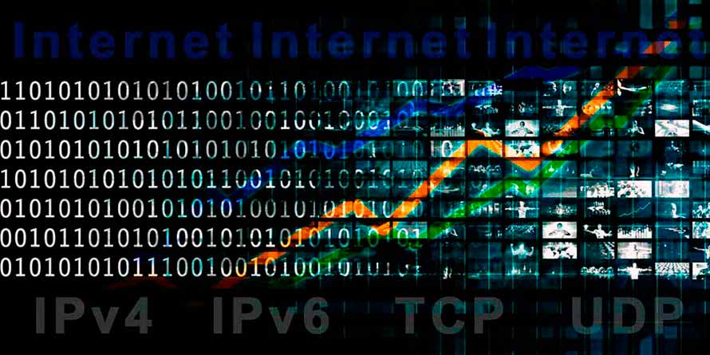

# 1.1 NUESTRO SECTOR PRODUCTIVO (INFORMATICA)

* ### PILAR AMBIENTAL
  + Acciones sostenibles: Uso de energías renovables para alimentar servidores, diseño de dispositivos más eficientes energéticamente, y reciclaje de componentes electrónicos.

  + ODS: 
    - **` ODS 7`**: Energia asequible y no contaminante (promover tecnologías energéticamente eficientes).
    - **` ODS 12`**: Producción y consumo responsables (reducir residuos electrónicos).
    - **` ODS 13`**: Acción por el clima (mitigar emisiones de CO2 del sector).

* ### PILAR SOCIAL
  + Acciones sostenibles: Programas de alfabetización digital, desarrollo de tecnologías inclusivas (software accesible para personas con discapacidades), y expansión de redes en áreas rurales.
  
  + ODS:
    - **` ODS 4`**: Educación de calidad (uso de TIC para la enseñanza).
    - **` ODS 10`**: Reducción de las desigualdades (acceso universal a la tecnología).
    - **` ODS 5`**: Igualdad de género (fomentar la participación de mujeres en carreras TIC).

* ### PILAR ECONOMICO
  + Acciones sostenibles: Desarrollo de software open-source, economía circular en hardware (reutilización y reciclaje), y apoyo a startups tecnológicas sostenibles.

  + ODS:
    - **` ODS 8`**: Trabajo decente y crecimiento económico (creación de empleos en TIC).
    - **` ODS 9`**: Industria, innovación e infraestructura (infraestructuras digitales sostenibles).
    - **` ODS 17`**: Alianzas para los objetivos (colaboración entre empresas y gobiernos para digitalización sostenible).

#### [INDICE](../indice_pisa3_4_leon.md)
#### [SIGUIENTE](./1.2_ODS_relevantes_leon.md)