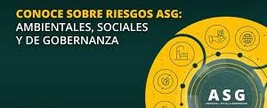

# 2.1 IDENTIFICACIÓN DE RIESGOS AMBIENTALES, SOCIALES Y ECONÓMICOS 

Los Objetivos de Desarrollo Sostenible (ODS) buscan equilibrar el crecimiento económico con el bienestar social y la preservación ambiental. Sin embargo, existen numerosos riesgos que pueden obstaculizar este avance.  

## RIESGOS AMBIENTALES  
El medio ambiente se enfrenta a amenazas que afectan la biodiversidad y el equilibrio ecológico:  
- **Cambio climático**: Aumento de temperaturas, fenómenos meteorológicos extremos.  
- **Degradación ambiental**: Pérdida de bosques, contaminación del agua y del aire.  
- **Exceso de residuos**: Mala gestión de desechos industriales y plásticos.  

## RIESGOS SOCIALES  
El bienestar de las personas puede verse comprometido por diversas problemáticas sociales:  
- **Desigualdad económica**: Acceso limitado a educación, salud y empleo digno.  
- **Condiciones laborales**: Explotación de trabajadores, falta de derechos básicos.  
- **Migraciones forzadas**: Desplazamientos debido a conflictos o desastres naturales.  

## RIESGOS ECONOMICOS  
Las empresas y gobiernos deben enfrentar retos financieros y estructurales:  
- **Escasez de recursos naturales**: Aumento de costos en producción.  
- **Incertidumbre regulatoria**: Cambios en leyes ambientales que impactan negocios.  
- **Crisis energéticas**: Dependencia de combustibles fósiles frente a la transición energética.  

#### [INDICE](../indice_pisa3_4_leon.md)
#### [SIGUIENTE](./2.2_Oportunidades_de_mejora_leon.md)