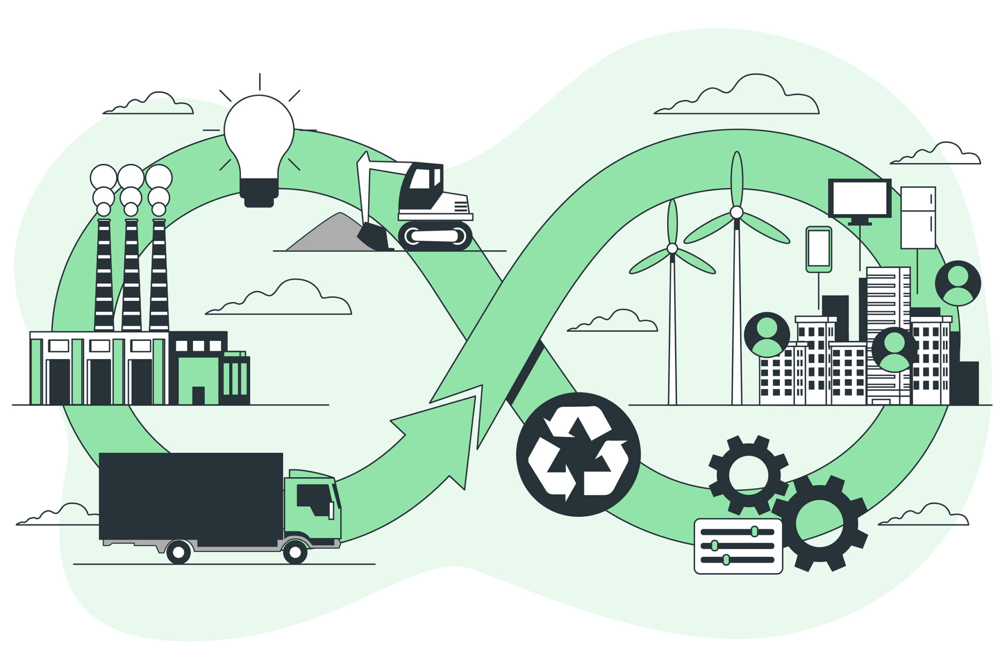
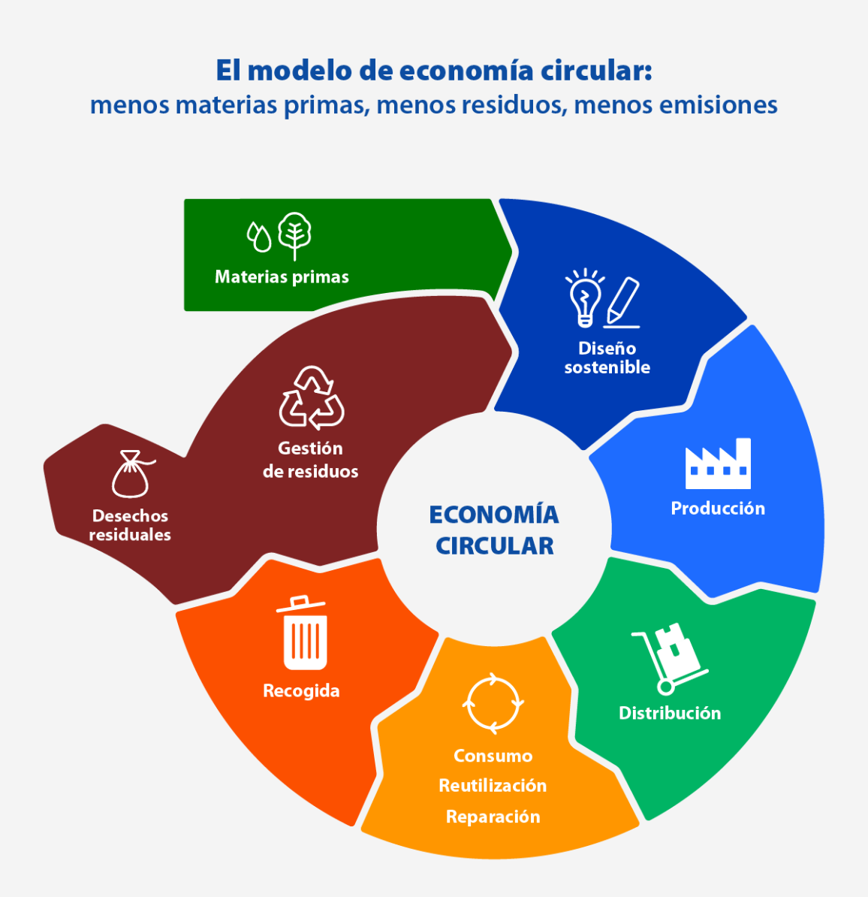

# 2.2 OPORTUNIDADES DE MEJORA E INNOVACIÓN SOSTENIBLE  

A pesar de los riesgos mencionados, existen grandes oportunidades para avanzar hacia un modelo más sostenible.  

## INNOVACIÓN TECNOLÓGICA  
La tecnología permite reducir la huella ambiental y mejorar procesos industriales:  
- **Energías renovables**: Solar, eólica e hidráulica como alternativas limpias.  
- **Materiales biodegradables**: Menor impacto ambiental en empaques y productos.  
- **Optimización de producción**: Inteligencia Artificial para minimizar desperdicios.  

## ECONOMÍA CIRCULAR Y NUEVOS MODELOS DE NEGOCIO  
Las empresas pueden adoptar enfoques sostenibles para mejorar su competitividad:  
- **Diseño de productos reutilizables**: Reducción de residuos y mayor durabilidad.  
- **Reciclaje y reutilización**: Transformación de desechos en nuevos productos.  
- **Cadenas de suministro responsables**: Uso eficiente de recursos naturales.  

## REGULACIONES Y POLÍTICAS DE APOYO  
Las normativas gubernamentales incentivan la sostenibilidad con medidas como:  
- **Subvenciones para energías limpias**.  
- **Impuestos a industrias contaminantes**.  
- **Programas de certificación ambiental**.  

 
 
 

# 2.2.1. INTEGRACIÓN DE LA ECONOMÍA CIRCULAR COMO VENTAJA COMPETITIVA  

La economía circular representa una de las estrategias más efectivas para mitigar impactos negativos y generar valor en las empresas.  

## ¿Qué es la economía circular?  
Es un modelo de producción y consumo que busca reducir residuos y maximizar la reutilización de materiales mediante:  
- **Reparación y reacondicionamiento de productos**.  
- **Uso eficiente de energía y materias primas**.  
- **Reducción del desperdicio en procesos productivos**.  

## Beneficios competitivos  
Las empresas que adoptan este modelo obtienen ventajas como:  
- **Reducción de costos operativos** mediante el reciclaje de materiales.  
- **Mayor innovación** con nuevos diseños de productos sostenibles.  
- **Mejora de la reputación corporativa** y mayor atractivo para inversionistas.  

## Ejemplo de aplicación  
En la industria automotriz, algunas empresas reutilizan plásticos reciclados en la fabricación de componentes internos de vehículos, reduciendo costos y minimizando el impacto ambiental.  

 
 
 

# 2.2.2. DIGITALIZACIÓN Y TECNOLOGÍAS PARA MITIGAR IMPACTOS NEGATIVOS  

La digitalización es una herramienta clave para mejorar la sostenibilidad y minimizar impactos negativos en la industria y la sociedad.  

## Tecnologías clave  
- **Big Data e Inteligencia Artificial**: Permiten optimizar el uso de energía y reducir desperdicios en procesos productivos.  
- **Internet de las Cosas (IoT)**: Dispositivos conectados que mejoran la eficiencia energética en fábricas y ciudades inteligentes.  
- **Blockchain**: Asegura transparencia en la cadena de suministro y certificaciones ambientales.  

## Impacto en la sostenibilidad  
El uso de estas tecnologías contribuye a:  
- **Reducir emisiones de CO₂** con sistemas de monitoreo energético.  
- **Mejorar la gestión del agua** con sensores inteligentes.  
- **Optimizar el transporte** con logística basada en datos en tiempo real.  

## Casos de éxito  
- Empresas que usan sensores para detectar fugas en redes de agua, reduciendo desperdicio.  
- Plataformas digitales que optimizan rutas de transporte para reducir consumo de combustible.  
- Inteligencia Artificial aplicada a la agricultura para mejorar la producción sin dañar el suelo.

#### [INDICE](../indice_pisa3_4_leon.md)
#### [SIGUIENTE](../bibliografia_pisa3_4_leon.md)