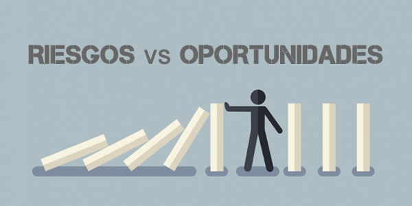

# 2 RIESGOS Y OPORTUNIDADES ASOCIADOS A LOS ODS MÁS RELEVANTES DE NUESTRO SECTOR  

### El desarrollo sostenible presenta tanto desafíos como oportunidades para las empresas y la sociedad. Identificar los riesgos ambientales, sociales y económicos es clave para minimizar impactos negativos y garantizar un crecimiento sostenible.  

### Por un lado, enfrentamos riesgos como el cambio climático, la desigualdad social y la dependencia de recursos no renovables. Estos pueden afectar la estabilidad económica y la calidad de vida a nivel global.  

### Por otro lado, la innovación y la economía circular abren nuevas oportunidades. Tecnologías como la digitalización, la inteligencia artificial y el Big Data permiten optimizar el uso de recursos y reducir desperdicios. Además, la adopción de modelos de negocio sostenibles puede generar ventajas competitivas para las empresas.  

### La transición hacia una economía más verde y digital requiere políticas y estrategias bien definidas. La integración de prácticas sostenibles no solo mitiga riesgos, sino que también fomenta la competitividad y el desarrollo a largo plazo.

#### [INDICE](../indice_pisa3_4_leon.md)
#### [SIGUIENTE](./2.1_Identificacion_de_riesgos_leon.md)